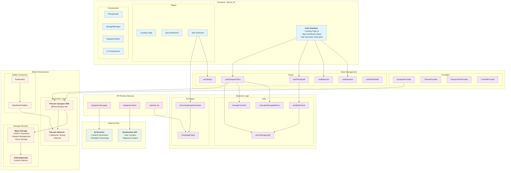

# System Architecture - WarmWeb Upload DApp

## Overview

The WarmWeb Upload DApp is a Next.js-based decentralized application that enables AI-powered website generation and deployment on the Filecoin network. This document provides a comprehensive overview of the system architecture, components, and data flows.

## System Architecture Diagram



## Architecture Layers

### 1. Frontend Layer (Next.js 15)

**Pages:**
- **Landing Page (/)**: Marketing site with features, testimonials, and call-to-action
- **App Dashboard (/app)**: File management and dataset viewing interface
- **Site Generator (/site-gen)**: AI-powered landing page creation and deployment

**Components:**
- **FileUploader**: Drag-and-drop file upload interface
- **StorageManager**: Manages storage allowances and payments
- **DatasetsViewer**: Displays user's Filecoin datasets
- **UI Components**: Reusable UI elements built with Radix UI

### 2. State Management

**Providers:**
- **SynapseProvider**: Manages Filecoin SDK connection and wallet state
- **ThemeProvider**: Handles light/dark mode theming
- **GeolocationProvider**: Manages user location data
- **ConfettiProvider**: Manages celebration animations

**Custom Hooks:**
- **useSynapseClient**: Core Filecoin operations and gas management
- **useFileUpload**: File upload orchestration with progress tracking
- **useBalances**: USDFC and FIL balance management
- **useDatasets**: Dataset discovery and management
- **useSiteZip**: Website packaging and compression
- **usePublishSite**: Site deployment to Filecoin

### 3. Business Logic

**AI Engine:**
- **AILandingPageGenerator**: Generates landing page content using AI
- **TemplateEngine**: Processes templates and injects dynamic content

**Utilities:**
- **preflightCheck**: Validates storage requirements before upload
- **warmStorageUtils**: Filecoin Warm Storage utility functions
- **storageCostUtils**: Storage cost calculations and estimates
- **calculateStorageMetrics**: Storage metrics and analytics

### 4. API Routes (Next.js)

- **/api/generate-page**: AI content generation endpoint
- **/api/geolocation**: User geolocation services
- **/api/site-zip**: Website packaging and ZIP generation

### 5. Web3 Infrastructure

**Wallet Connection:**
- **RainbowKit**: Wallet connection UI and management
- **MetaMask/Wallets**: Supports multiple Web3 wallets

**Blockchain Layer:**
- **Filecoin Network**: Both Calibration testnet and mainnet support
- **Filecoin Synapse SDK**: Official SDK for Filecoin operations

**Storage Services:**
- **Warm Storage**: Managed Filecoin storage with USDFC payments
- **CDN**: Optional content delivery network integration

### 6. External Services

- **AI Services**: Third-party AI APIs for content generation
- **Geolocation API**: External geolocation services

## Key Data Flows

### 1. File Upload Flow
```
User → FileUploader → useSynapseClient → preflightCheck → Synapse SDK → Filecoin Network
```

**Steps:**
1. User selects file via FileUploader component
2. useSynapseClient hook handles upload orchestration
3. preflightCheck validates storage requirements and balances
4. Synapse SDK manages blockchain transactions
5. File is stored on Filecoin network

### 2. AI Site Generation Flow
```
User Input → AILandingPageGenerator → TemplateEngine → Site ZIP → Filecoin Upload
```

**Steps:**
1. User provides business details and preferences
2. AILandingPageGenerator creates content using AI services
3. TemplateEngine processes templates and injects content
4. Site is packaged into ZIP format
5. ZIP is uploaded to Filecoin via standard upload flow

### 3. Storage Management Flow
```
User → StorageManager → useDatasets → Synapse SDK → Warm Storage
```

**Steps:**
1. User manages storage settings via StorageManager
2. useDatasets hook retrieves user's datasets
3. Synapse SDK communicates with Warm Storage service
4. Storage allowances and payments are managed

### 4. Payment Flow
```
User → Wallet → USDFC Payments → Warm Storage Allowances → File Storage
```

**Steps:**
1. User connects wallet (MetaMask, etc.)
2. USDFC tokens are used for payments
3. Warm Storage allowances are set based on storage needs
4. Files can be stored once payments are confirmed

## Technology Stack

### Frontend Technologies
- **Next.js 15**: React framework with app router
- **React 18**: UI component library
- **TailwindCSS**: Utility-first CSS framework
- **Framer Motion**: Animation library
- **Radix UI**: Headless UI component library
- **Lucide React**: Icon library

### Web3 Technologies
- **@filoz/synapse-sdk**: Official Filecoin SDK
- **RainbowKit**: Wallet connection library
- **wagmi**: React hooks for Ethereum
- **viem**: TypeScript Ethereum library

### Storage & Blockchain
- **Filecoin Network**: Decentralized storage network
- **Warm Storage Service**: Managed Filecoin storage
- **USDFC Token**: Payment mechanism for storage

### Development & Build Tools
- **TypeScript**: Type-safe JavaScript
- **ESLint**: Code linting
- **Prettier**: Code formatting
- **Vercel**: Deployment platform

### AI & Content Processing
- **Custom AI Integration**: Content generation services
- **JSZip**: File compression and packaging
- **Template Engine**: Dynamic content processing

## Security Considerations

1. **Wallet Security**: All transactions require user approval via connected wallet
2. **Gas Management**: Implemented fixed gas calculations to prevent estimation failures
3. **Balance Validation**: Preflight checks ensure sufficient funds before operations
4. **Error Handling**: Comprehensive error handling for blockchain operations
5. **Type Safety**: Full TypeScript implementation for type safety

## Deployment Architecture

### Production Environment
- **Frontend**: Deployed on Vercel with CDN
- **API Routes**: Serverless functions on Vercel
- **Blockchain**: Connected to Filecoin mainnet
- **Storage**: Filecoin Warm Storage for production data

### Development Environment
- **Frontend**: Local Next.js development server
- **Blockchain**: Connected to Filecoin Calibration testnet
- **Storage**: Test storage with tFIL tokens

## Performance Optimizations

1. **Code Splitting**: Next.js automatic code splitting
2. **Image Optimization**: Next.js built-in image optimization
3. **Caching**: Strategic caching of blockchain data
4. **Lazy Loading**: Components loaded on demand
5. **Bundle Optimization**: Optimized production builds

## Monitoring & Analytics

- **Vercel Analytics**: Performance monitoring
- **Vercel Speed Insights**: Core web vitals tracking
- **Custom Telemetry**: Upload success/failure tracking
- **Error Tracking**: Comprehensive error logging

---

This architecture provides a robust, scalable, and user-friendly platform for AI-powered website generation and deployment on the Filecoin network, combining modern web development practices with cutting-edge blockchain technology.