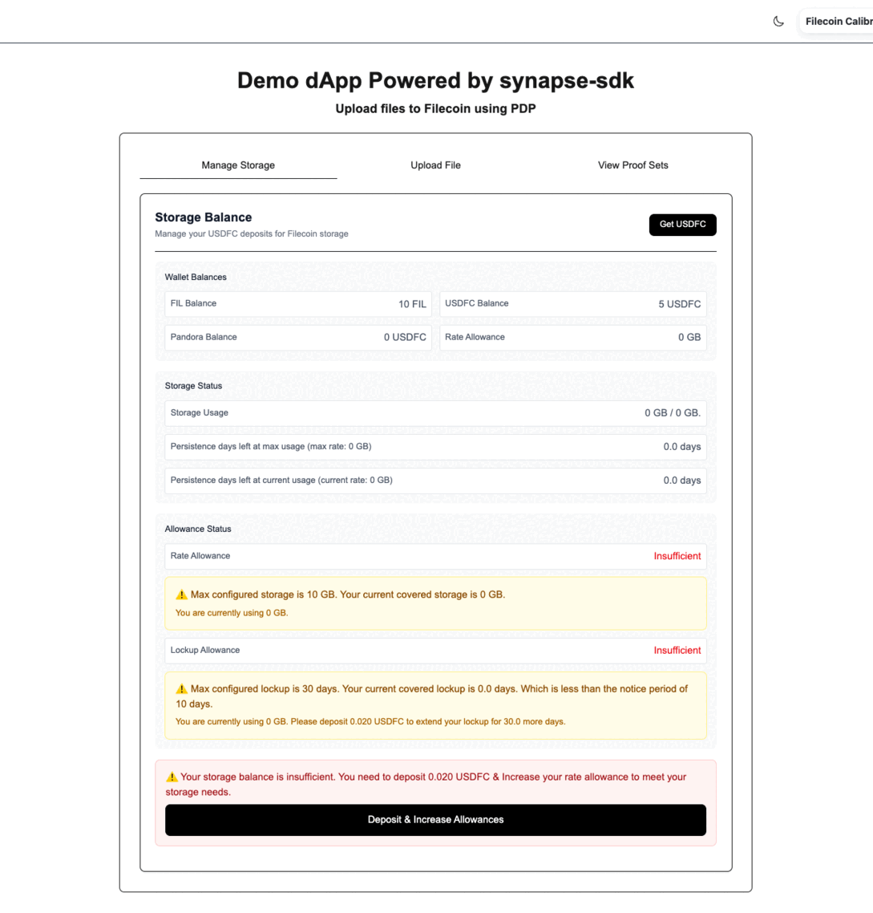
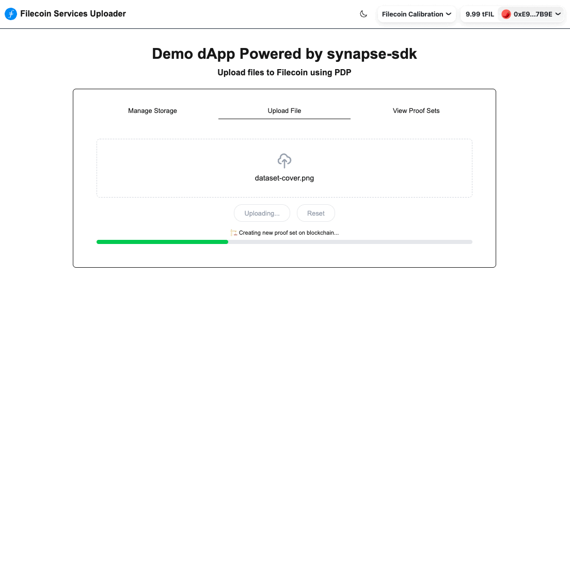
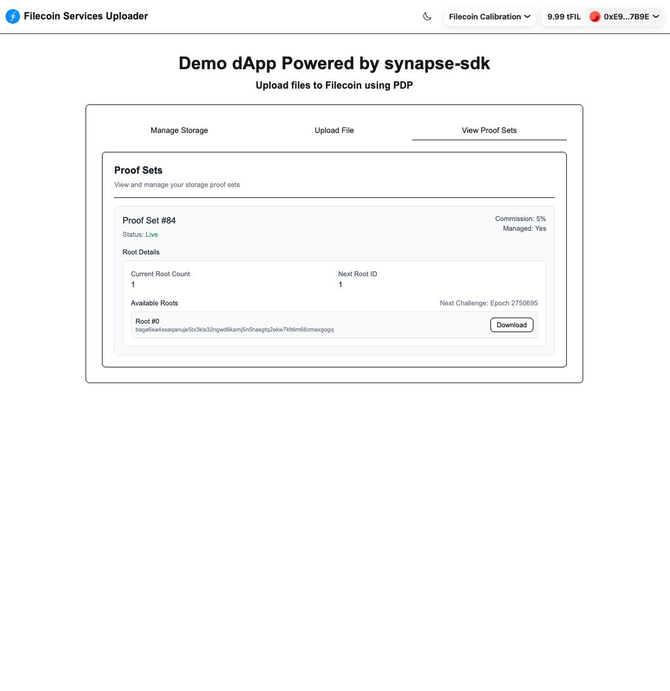

# 🚀 Understanding the Filecoin Synapse dApp

This tutorial explains how the **fs-upload-dapp** works—a production-ready Next.js application demonstrating file storage on Filecoin using the **synapse-sdk**. Instead of building from scratch, you'll explore the core workflows and understand how hooks and utilities power the application. 📚

[synapse-sdk](https://github.com/FilOzone/synapse-sdk) is a JS/TS SDK for interacting with **Filecoin Synapse** - a smart-contract based marketplace for a collection of services derived from the Filecoin ecosystem, such as Filecoin onchain payment service, hot storage service using PDP, retrieval service, etc. 🛠️

## ⚡ Quick Start

1. **Clone and Setup:** 📥

```sh
# Clone the repository and start the app
git clone https://github.com/FIL-Builders/fs-upload-dapp
cd fs-upload-dapp
npm install
npm run dev
```

2. **Prerequisites:** 📋

- [Node.js](https://nodejs.org/en) 18+ and [npm](https://www.npmjs.com/) 📦
- A Web3 wallet (like MetaMask) with some test USDFC & tFIL tokens 💰
- Basic knowledge of React and TypeScript 💻
- Basic understanding of blockchain concepts ⛓️

3. **Acquire Testnet Tokens:** 🪙

- **tFIL**: [Filecoin Calibration Faucet](https://faucet.calibnet.chainsafe-fil.io/funds.html) for gas fees. ⛽
- **tUSDFC**: [ChainSafe USDFC Faucet](https://forest-explorer.chainsafe.dev/faucet/calibnet_usdfc) (limit \$5 per request). 💵

## 📱 App Overview

The application is organized into four primary workflows, powered by custom hooks and utilities:

- **💰 Balance & Storage Management:** [`useBalances`](https://github.com/FIL-Builders/fs-upload-dapp/blob/main/hooks/useBalances.ts), [`calculateStorageMetrics`](https://github.com/FIL-Builders/fs-upload-dapp/blob/main/utils/calculateStorageMetrics.ts)
- **💳 Storage Payments with USDFC:** [`usePayment`](https://github.com/FIL-Builders/fs-upload-dapp/blob/main/hooks/usePayment.ts)
- **📤 File Uploads:** [`useFileUpload`](https://github.com/FIL-Builders/fs-upload-dapp/blob/main/hooks/useFileUpload.ts), [`preflightCheck`](https://github.com/FIL-Builders/fs-upload-dapp/blob/main/utils/preflightCheck.ts)
- **🔍 Data Set Resolution:** [`useDatasets`](https://github.com/FIL-Builders/fs-upload-dapp/blob/main/hooks/useDatasets.ts)
- **📥 File Downloads:** [`useDownloadPiece`](https://github.com/FIL-Builders/fs-upload-dapp/blob/main/hooks/useDownloadPiece.ts)

### 💸 How Payments Work

The Synapse payment system uses two complementary allowances:

#### 1. **Rate Allowance** (`rateAllowance`)

- **Definition:** Maximum USDFC the FilecoinWarmStorageService can spend per epoch.
- **Purpose:** Automates payments to storage providers for ongoing storage.
- **Calculation:** Proportional to your storage needs - higher storage requirements demand higher epoch rates.

#### 2. **Lockup Allowance** (`lockupAllowance`)

- **Definition:** Total USDFC that FilecoinWarmStorageService can reserve upfront to guarantee storage provider payments for your target persistence duration.
- **Purpose:** Secures payment for the entire storage period and enables uninterrupted Proof of Data Possession (PDP) validation.
- **Calculation:** (Rate allowance × target persistence days) + existing lockup commitments

### Storage Configuration

The [`calculateStorageMetrics`](https://github.com/FIL-Builders/fs-upload-dapp/blob/main/utils/calculateStorageMetrics.ts) utility calculates payment requirements based on the [app configuration](https://github.com/FIL-Builders/fs-upload-dapp/blob/main/config.ts):

```typescript
export const config = {
  storageCapacity: 10, // GB, maximum storage capacity
  persistencePeriod: 30, // days, data persistence duration
  minDaysThreshold: 10, // days, threshold for low-balance warnings
  // Whether to use CDN for the storage for faster retrieval
  withCDN: true,
};
```

### ⚙️ Configuration Impact

- **Higher `storageCapacity`** → Increased rate and lockup allowances. 📈
- **Longer `persistencePeriod`** → Higher lockup allowance (more epochs to cover). ⏰
- **Lower `minDaysThreshold`** → Earlier warnings about balance depletion. ⚠️
- **`withCDN`** → Lightning ⚡ fast retrievals for a higher price 💰

## 💰 Balance & Storage Management

**Component**: [`StorageManager.tsx`](https://github.com/FIL-Builders/fs-upload-dapp/blob/main/components/StorageManager.tsx)

Allows users to monitor balances and manage subscription payments to maintain persistent storage on Filecoin with Proof of Data Possession (PDP).



### How it Works

The component relies on two main hooks:

The [`useBalances`](https://github.com/FIL-Builders/fs-upload-dapp/blob/main/hooks/useBalances.ts) hook provides real-time visibility into:

- **Wallet Balances**: FIL and USDFC in your wallet
- **Synapse Contract Balance**: USDFC deposited in Synapse for storage payments
- **Storage Usage**: Current data stored vs. configured capacity
- **Persistence**: Days remaining before payment rates are exhausted

Fetching balances and storage metrics via:

```typescript
const { data, isLoading, isError, error } = useBalances();
const {
  filBalance,
  usdfcBalance,
  filecoinWarmStorageServiceBalance,
  persistenceDaysLeft,
  isSufficient,
  rateNeeded,
  lockUpNeeded,
  depositNeeded,
} = data;
```

The [`usePayment`](https://github.com/FIL-Builders/fs-upload-dapp/blob/main/hooks/usePayment.ts) hook handles payments with inputs being calculated by the `useBalances` hook:

1. **Approve & Deposit USDFC** to Synapse payment contract for storage escrow
2. **Approve FilecoinWarmStorageService** to spend USDFC at specified rates for automated payments per epoch

Payment handling via:

```typescript
const { mutation: paymentMutation, status } = usePayment();
const { mutateAsync: handlePayment } = paymentMutation;

await handlePayment({
  lockupAllowance: BigInt(lockUpNeeded),
  epochRateAllowance: BigInt(rateNeeded),
  depositAmount: BigInt(depositNeeded),
});
```

## 📤 File Uploads with Synapse SDK

**Component**: [`FileUploader.tsx`](https://github.com/FIL-Builders/fs-upload-dapp/blob/main/components/FileUploader.tsx)

The FileUploader component streamlines file uploads using the Synapse SDK.



### How it Works

The [`useFileUpload`](https://github.com/FIL-Builders/fs-upload-dapp/blob/main/hooks/useFileUpload.ts) hook orchestrates the full process to upload a file using synapse sdk.

1. **Preflight Check**: Ensures sufficient USDFC balance via [`preflightCheck`](https://github.com/FIL-Builders/fs-upload-dapp/blob/main/utils/preflightCheck.ts)

   - 💰 **Insufficient Balance**: Prompts user to deposit more USDFC if current balance is inadequate
   - ✅ **Balance Verified**: Proceeds to next step when sufficient funds are available

2. **Data Set Resolution**: Finds or creates the dataset for file upload via [`getDataset`](https://github.com/FIL-Builders/fs-upload-dapp/blob/main/utils/getDataset.ts)

   - 🔍 **Existing Dataset**: Uses the current active dataset if one exists
   - ⚡ **New Dataset**: Creates a new dataset if none exists for the user

3. **File Upload**: Uploads to Filecoin with PDP (Proof of Data Possession) by interacting with the storage provider that handles the dataset
   - 📤 **File Transfer**: Securely uploads file data to the designated storage provider
   - 🔐 **Piece Registration**: Signs and sends an `addpiece` request to the storage provider, enabling them to submit the file piece to the dataset for PDP verification

Uploading a file via:

```typescript
const { uploadFileMutation, progress, status, uploadedInfo } = useFileUpload();
const { mutateAsync: uploadFile } = uploadFileMutation;

// Upload with progress tracking
await uploadFile(selectedFile);
```

## 🔍 Data Set Management & Inspection

**Component**: [`ViewDataSets.tsx`](https://github.com/FIL-Builders/fs-upload-dapp/blob/main/components/ViewDataSets.tsx)

### Dataset Viewer

The ViewDataSets component provides a dashboard to monitor data sets and manage file downloads.



### How it Works

The [`useDatasets`](https://github.com/FIL-Builders/fs-upload-dapp/blob/main/hooks/useDatasets.ts) hook provides visibility into:

- **Client Data Sets**: All data sets associated with your address
- **Provider Details**: Information about storage providers
- **Data Set Status**: Current state and details from provider APIs

Getting datasets via:

```typescript
const { data, isLoading: isLoadingDatasets } = useDatasets();

const { datasets } = data;

const datasetCIDs = Record<string, string[]>();

datasets.forEach((dataset) => {
  if (dataset.details?.pieces) {
    datasetCIDs[dataset.railId] = dataset.details.pieces.map(
      (piece) => piece.pieceCid
    );
  }
});
```

---

The [`useDownloadPiece`](https://github.com/FIL-Builders/fs-upload-dapp/blob/main/hooks/useDownloadPiece.ts) hook enables file downloads from storage providers using the file's piece CID and filename. The filename helps determine the correct MIME type for proper browser handling.

Downloading a file via:

```typescript
const { downloadMutation } = useDownloadPiece(pieceCID, filename);
const { mutateAsync: downloadFile } = downloadMutation;

// Download file
await downloadFile();
```

## 🚀 Next Steps

- **📊 Monitor Storage**: Use the data set viewer to track your stored data
- **💡 Optimize Costs**: Adjust persistence periods based on usage patterns
- **📈 Scale Up**: Increase storage capacity and deposit additional USDFC as your data usage grows
- **🔧 Integrate**: Use the patterns to build your own decentralized powered storage applications

## 📚 Resources

- **Live Demo**: [fs-upload-dapp.netlify.app](https://fs-upload-dapp.netlify.app/)
- **Source Code**: [GitHub Repository](https://github.com/FIL-Builders/fs-upload-dapp)
- **Synapse SDK**: [NPM Package](https://www.npmjs.com/package/@filoz/synapse-sdk)
- **PDP**: [PDP Docs](https://github.com/FilOzone/pdp/blob/main/docs/design.md)
- **Payments contract**: [Payments Contracts](https://github.com/FilOzone/filecoin-services-payments/blob/main/README.md)
- **FilecoinWarmStorageService**: [FilecoinWarmStorageService Contracts](https://github.com/FilOzone/filecoin-services/blob/main/README.md)
- **USDFC Documentation**: [Secured Finance](https://docs.secured.finance/usdfc-stablecoin/getting-started)
